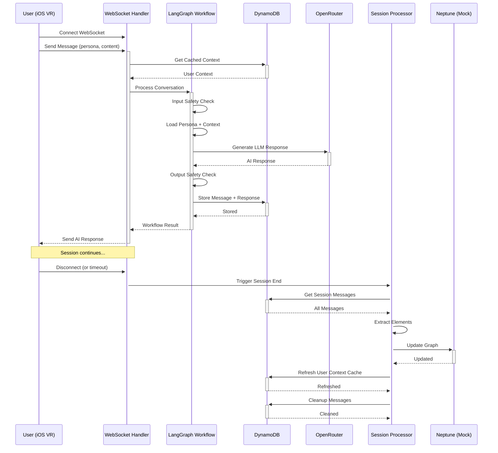

# InnerWorld Backend - Phase 2

Complete serverless conversation AI pipeline for the InnerWorld AR app, implementing Phase 2 real-time conversation and session management.

## Phase 2 Implementation ✅

**Phase 1 Foundation:**
- ✅ Basic Lambda function structure (conversation handler + health check)
- ✅ OpenRouter API client for LLM conversations
- ✅ OpenAI API client for text embeddings  
- ✅ Mock Neptune connection layer
- ✅ Local development environment

**Phase 2 - Real-Time Conversation Pipeline:**
- ✅ **3 Lambda Functions**: Login Context Handler, WebSocket Handler, Session End Processor
- ✅ **LangChain-Go Integration**: input_safety → persona_prompt → llm_generation → output_safety → live_storage
- ✅ **Persona Loading System**: Configurable loader with default template (expandable for Phase 4+)
- ✅ **DynamoDB Operations**: LiveConversations storage (24-hour TTL), UserContextCache with TTL
- ✅ **Context Caching**: Login-time Neptune context retrieval for performance
- ✅ **Session Processing**: Conversation element extraction and graph updates
- ✅ **Error Handling**: Retry logic, circuit breakers, resilience patterns

## Quick Start

### Prerequisites
- Go 1.21+
- Docker Desktop
- Optional: OpenRouter & OpenAI API keys

### Setup
```bash
cd backend/
make setup               # Initial setup
make dev-start          # Start development environment
./scripts/build-phase2.sh   # Build Phase 2 Lambda functions
./scripts/test-phase2.sh    # Run comprehensive Phase 2 tests
```

## Phase 2 Architecture

```
backend/
├── cmd/
│   ├── conversation-handler/     # Phase 1 basic handler
│   ├── health-check/            # Health monitoring
│   ├── login-context-handler/   # 🆕 Login context caching
│   ├── websocket-handler/       # 🆕 Real-time conversation
│   ├── session-processor/       # 🆕 Session end processing
│   └── test-phase2/            # 🆕 Integration tests
├── internal/
│   ├── config/                 # Configuration management
│   ├── embeddings/             # OpenAI client
│   ├── graph/                  # Neptune interface + mock
│   ├── llm/                    # OpenRouter client
│   ├── personas/               # 🆕 Persona loading system
│   ├── resilience/             # 🆕 Error handling & retry logic
│   ├── storage/                # 🆕 DynamoDB mock operations
│   ├── types/                  # 🆕 Phase 2 data structures
│   └── workflow/               # 🆕 LangGraph conversation workflow
├── scripts/
│   ├── build-phase2.sh         # 🆕 Phase 2 build script
│   └── test-phase2.sh          # 🆕 Phase 2 test script
└── docker-compose.yml          # LocalStack
```

## Phase 2 Core Components

### 1. Login Context Handler Lambda
- **Trigger**: Cognito Post-Authentication
- **Purpose**: Cache user's Neptune GraphRAG context at login
- **Process**: Neptune context retrieval → DynamoDB cache storage
- **Performance**: Heavy operation done once per login session

### 2. WebSocket Message Handler Lambda  
- **Triggers**: API Gateway WebSocket (`$connect`, `$disconnect`, `sendmessage`)
- **Purpose**: Real-time conversation processing
- **Workflow**: Cached context → LangGraph → OpenRouter LLM → WebSocket response
- **Features**: Connection management, persona selection, session tracking

### 3. Session End Processor Lambda
- **Triggers**: WebSocket disconnect or manual session end
- **Purpose**: Convert conversation into Neptune graph nodes/edges  
- **Process**: DynamoDB messages → element extraction → Neptune updates → context refresh
- **Cleanup**: Remove processed conversation data with TTL

### 4. LangChain-Go Conversation Processing
- **Pipeline**: input_safety → persona_prompt → llm_generation → output_safety → live_storage using LangChain-Go
- **Safety**: Bidirectional safety checks - both user inputs and AI responses filtered for harmful content
- **Personas**: Load configured persona template with user context injection
- **Storage**: Both user message and AI response stored in DynamoDB

### 5. Persona Loading System
- **Default Template**: Single supportive companion template for Phase 2 testing
- **Configurable Loader**: Expandable system for Phase 4+ persona implementations
- **Context-Aware**: Inject user's GraphRAG context into system prompts
- **Boundaries**: Built-in safety guidelines and age-appropriate constraints

### 6. DynamoDB Storage (Mock)
- **LiveConversations**: Message-per-item with session GSI, 24-hour TTL
- **UserContextCache**: Cached Neptune context, 1-hour TTL
- **Performance**: Fast context access during conversations
- **Cleanup**: Automatic TTL-based data removal

### 7. Error Handling & Resilience
- **Retry Logic**: Exponential backoff with configurable attempts
- **Circuit Breakers**: Fail-fast for consistently failing services  
- **Service-Specific**: Different retry logic for Neptune, DynamoDB, OpenRouter
- **Graceful Degradation**: Fallback responses when services fail

## Phase 2 API Examples

### WebSocket Message (Conversation)
```json
{
  "action": "sendmessage",
  "message": "I'm nervous about my presentation tomorrow",
  "persona": "courage",
  "sessionId": "session_123",
  "userId": "user_456"
}
```

### WebSocket Response
```json
{
  "messageId": "msg_abc123",
  "content": "You've got this! What's one small step you could take to prepare?",
  "persona": "courage",
  "timestamp": "2024-01-15T10:05:00Z",
  "sessionId": "session_123",
  "messageType": "assistant"
}
```

### Login Context Request (Cognito Trigger)
```json
{
  "userId": "user_456",
  "loginSessionId": "login_789"
}
```

### Session End Request
```json
{
  "sessionId": "session_123",
  "userId": "user_456", 
  "reason": "manual"
}
```

## Phase 2 Development

### Build & Test
```bash
# Phase 2 specific commands
./scripts/build-phase2.sh   # Build all 3 Lambda functions
./scripts/test-phase2.sh    # Run comprehensive tests

# Legacy Phase 1 commands still work
make help                   # Show all commands
make dev-start             # Start LocalStack environment  
make build                 # Build Phase 1 functions
make test-conversation     # Test basic conversation
make test-health           # Test health check system
```

### Testing Individual Components
```bash
# Test persona system
go run cmd/test-phase2/main.go

# Test individual Lambda functions
echo '{"userId": "test-user"}' | go run cmd/login-context-handler/main.go
echo '{"action": "sendmessage", "message": "Hello", "persona": "comfort"}' | go run cmd/websocket-handler/main.go
echo '{"sessionId": "test-session", "userId": "test-user", "reason": "manual"}' | go run cmd/session-processor/main.go

# Test all 4 personas
for persona in courage comfort creative compass; do
  echo "{\"action\":\"sendmessage\",\"message\":\"Test message\",\"persona\":\"$persona\"}" | go run cmd/websocket-handler/main.go
done
```

## Phase 2 Conversation Flow



## Dependencies & Blockers

### Infrastructure Dependencies (Nataly)
- **WebSocket API Gateway** with Lambda integration
- **DynamoDB tables**: `LiveConversations`, `UserContextCache`  
- **Lambda layers**: OpenRouter, Neptune, LangGraph dependencies
- **IAM roles**: Lambda access to Neptune, DynamoDB, Cognito

### Graph Database Dependencies (Hutch)
- **Neptune GraphRAG schema**: Node types (Event, Feeling, Value, Goal, Habit, Person, Topic)
- **Edge relationships**: temporal, causal, about, supports, conflicts, felt_during
- **Gremlin queries**: Context retrieval and graph update patterns

### Mock Implementations (Phase 2 Ready)
- **Mock DynamoDB**: In-memory storage for development/testing
- **Mock Neptune**: Basic context storage and graph operations
- **Mock WebSocket**: Response logging instead of actual WebSocket calls
- **Fallback responses**: When OpenRouter API unavailable

## Testing

### 🎯 End-to-End Conversation Test (Recommended)
```bash
./scripts/test-e2e-conversation.sh
```
This comprehensive test demonstrates the complete WebSocket conversation flow:
- Setup and component initialization
- Neptune context loading and DynamoDB caching  
- Bidirectional safety checks (input + output)
- Persona context injection with system prompts
- Message storage with 24-hour TTL verification
- WebSocket disconnect and resource cleanup

### Unit Tests
```bash
# Run all Phase 2 unit tests
./scripts/test-phase2.sh

# Run specific component tests
go test ./internal/... -v

# Build all Lambda functions  
./scripts/build-phase2.sh
```

## Production Deployment

### Lambda Functions Ready for Deploy
```bash
./scripts/build-phase2.sh
ls bin/
# login-context-handler.zip
# websocket-handler.zip  
# session-processor.zip
```

### Environment Variables Needed
```bash
# OpenRouter API (optional for development)
OPENROUTER_API_KEY=your-key-here

# Neptune (production) 
NEPTUNE_ENDPOINT=your-neptune-cluster.region.neptune.amazonaws.com
NEPTUNE_PORT=8182

# DynamoDB Tables
LIVE_CONVERSATIONS_TABLE=LiveConversations-dev
USER_CONTEXT_CACHE_TABLE=UserContextCache-dev
```

---

**Status: Phase 2 Complete ✅**  
**Ready for**: Infrastructure deployment and Phase 3 integration  
**Next**: Trevor's VR frontend WebSocket client integration