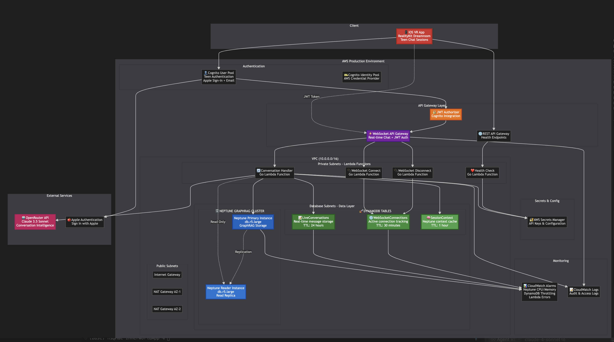

# InnerWorldApp Infrastructure

This directory contains the **cost-optimized** Terraform Infrastructure as Code (IaC) for the InnerWorldApp project. The infrastructure is designed to support TestFlight deployment with minimal cost while maintaining production-ready patterns.

## Overview

The infrastructure provides a **simple, cost-effective** serverless backend for iOS VR conversations:

- **VPC & Networking**: Multi-AZ VPC with public/private subnets and NAT gateways
- **AWS Cognito**: Teen authentication with Apple Sign-In and email/password support
- **DynamoDB**: Real-time conversation storage with TTL cleanup
- **WebSocket API**: JWT-secured real-time chat with Lambda handlers
- **S3 Storage**: App assets and TestFlight build storage
- **GitHub Actions**: Simple CI/CD pipeline for iOS deployment
- **Secrets Manager**: Secure storage for API keys and credentials
- **Cost-Optimized**: **~$180/month** with minimal monitoring and Neptune disabled

## Infrastructure Architecture

### Complete Production Architecture Diagram



**Current Architecture Overview:**
- **Client Layer**: iOS VR App with RealityKit, Teen Chat, Sessions
- **Authentication**: AWS Cognito User Pool with Apple Sign-In integration
- **API Gateway**: WebSocket API with JWT authentication for real-time chat
- **Compute Layer**: Go Lambda Functions (Connect, Disconnect, Conversation, Health Check)
- **Database Layer**: DynamoDB for live conversation storage with TTL
- **Storage Layer**: S3 buckets for app assets and TestFlight builds
- **External Services**: OpenRouter API (Claude 3.5 Sonnet), Apple Authentication
- **Security**: AWS Secrets Manager for API keys and configuration
- **CI/CD**: GitHub Actions for iOS deployment and TestFlight automation
- **Networking**: Multi-AZ VPC with Public/Private subnets, NAT Gateways

**Cost Optimizations Applied:**
- ❌ **Neptune GraphRAG**: Disabled (saves ~$200+/month) - can be enabled later
- ❌ **VPC Flow Logs**: Disabled (saves ~$15/month)
- ❌ **Enhanced CloudWatch**: Minimal logging (saves ~$20/month)
- ❌ **Multiple DynamoDB tables**: Simplified to core conversation storage
- ✅ **Multi-AZ NAT**: Maintained for reliability (as requested)

### Terraform Module Structure

```
┌─ Production Environment ─┐    ┌─ Core Modules ─┐
│                          │    │                │
│ └── prod/               │ => │ networking     │
│     ├── main.tf         │    │ cognito        │
│     └── terraform.tfvars│    │ s3             │
│                          │    │ dynamodb       │
└──────────────────────────┘    │ lambda         │
                                │ secrets        │
┌─ Shared Backend ─┐             └────────────────┘
│                  │                     ↑
│ backend.tf       │ ────────────────────┘
│                  │
└──────────────────┘
```

## Teen VR Chat Flow & Data Architecture

### Authentication & Connection Flow
```
1. Teen opens VR app → Apple Sign-In / Email auth
2. AWS Cognito validates → JWT token generated  
3. WebSocket connection → JWT authorizer validates token
4. Connect Handler Lambda → Store connection in DynamoDB
5. Session context retrieved from Neptune → Cached in DynamoDB
```

### Real-Time Conversation Flow
```
1. Teen sends VR message → WebSocket API Gateway
2. Conversation Handler Lambda processes message
3. Current context fetched from DynamoDB SessionContext table
4. Historical emotional patterns retrieved from Neptune GraphRAG
5. OpenRouter API called (Claude 3.5 Sonnet) with context
6. OpenAI embeddings generated for message categorization
7. Response delivered via WebSocket → VR app displays
8. Message stored in DynamoDB LiveConversations (24h TTL)
```

### GraphRAG User Context Processing
```
1. Session ends → Conversation messages analyzed
2. NER (Named Entity Recognition) processes user messages post-chat
3. User context themes extracted → Graph embeddings created
4. Neptune graph updated with new context patterns:
   - People (individuals mentioned, relationships)
   - Places (locations, environments)
   - Things (objects, items of significance)
   - Topics (subjects of conversation, interests)
   - Events (experiences, activities, milestones)
   - Activities (actions, behaviors, routines)
   - Goals (aspirations, objectives, achievements)
5. Context cache refreshed in DynamoDB SessionContext
6. TTL cleanup removes processed live conversations
```

### Database Design Patterns

#### Neptune GraphRAG Schema
```
Vertices: Teen, Person, Place, Thing, Topic, Event, Activity, Goal
Edges: temporal, causal, about, supports, conflicts, relates_to, involves, mentions

Example Graph Pattern:
Teen --mentions--> Person --relates_to--> SchoolStress --temporal--> MorningRoutine
Teen --involves--> Activity --supports--> Goal --about--> Topic
```

#### DynamoDB Table Design
```
LiveConversations:
  PK: conversation_id (session_date)
  SK: message_sequence  
  GSI: SessionIndex (session_id), UserIndex (user_id)
  TTL: 24 hours (processed → Neptune → deleted)

WebSocketConnections:
  PK: connection_id
  Attributes: user_id, session_id, connected_at
  GSI: UserConnectionsIndex, SessionConnectionsIndex  
  TTL: 30 minutes (auto-cleanup stale connections)

SessionContext:
  PK: user_id
  SK: session_id
  Attributes: cached_context, user_state, conversation_history
  TTL: 1 hour (refreshed each session)
```

## Quick Start

> 📋 **For complete step-by-step instructions, see**: [`docs/MANUAL_DEPLOYMENT_GUIDE.md`](../docs/MANUAL_DEPLOYMENT_GUIDE.md)

### Prerequisites

1. **AWS CLI configured** with admin permissions
2. **Terraform >= 1.5** installed
3. **Apple Developer Account** with Team ID, certificates, and App Store Connect API key
4. **OpenRouter API Key** for LLM conversations
5. **GitHub repository** with admin access for CI/CD

### Simple Deployment Process

```bash
# 1. Deploy shared backend infrastructure
cd infrastructure/shared
terraform init && terraform apply

# 2. Configure and deploy main infrastructure  
cd ../environments/prod
cp terraform.tfvars.example terraform.tfvars
# Edit terraform.tfvars with your credentials
terraform init && terraform apply -var-file=terraform.tfvars

# 3. Configure GitHub Actions for iOS CI/CD
# Follow complete instructions in MANUAL_DEPLOYMENT_GUIDE.md
```

### What Gets Deployed (~$180/month)

✅ **Core Infrastructure:**
- Multi-AZ VPC with NAT gateways (as requested)
- AWS Cognito for Apple Sign-In authentication
- Lambda functions for WebSocket API and conversation handling
- DynamoDB for real-time conversation storage with TTL
- S3 buckets for app assets and TestFlight build storage
- Secrets Manager for secure credential storage
- GitHub Actions integration for iOS CI/CD

❌ **Disabled for Cost Optimization:**
- Neptune GraphRAG (~$200/month saved, can enable later)
- VPC Flow Logs (~$15/month saved)
- Enhanced CloudWatch monitoring (~$20/month saved)

### Step 3: Configure Secrets

After deployment, update the secrets in AWS Secrets Manager:

```bash
# Update OpenRouter API key
aws secretsmanager update-secret \
  --secret-id "innerworld-prod/openai/api-key" \
  --secret-string '{"api_key":"sk-or-v1-your-key","provider":"openrouter","base_url":"https://openrouter.ai/api/v1","model_primary":"anthropic/claude-3.5-sonnet","model_fallback":"openai/gpt-4"}'

# Update Apple Sign-In credentials
aws secretsmanager update-secret \
  --secret-id "innerworld-prod/apple/signin-key" \
  --secret-string '{"team_id":"YOUR_TEAM_ID","key_id":"YOUR_KEY_ID","private_key":"YOUR_PRIVATE_KEY","client_id":"com.gauntletai.innerworld"}'
```

### Step 4: Verify Deployment

```bash
# Check all outputs
terraform output

# Test API endpoints
curl $(terraform output -raw api_endpoints | jq -r '.health_check_url')

# Verify Neptune cluster is running
aws neptune describe-db-clusters --db-cluster-identifier innerworld-prod-neptune-cluster
```

## Directory Structure

```
infrastructure/
├── README.md                          # This file
├── main.tf                           # Root module configuration
├── variables.tf                      # Root module variables
├── outputs.tf                       # Root module outputs
│
├── environments/                     # Production environment
│   └── prod/
│       ├── main.tf                  # Production configuration
│       └── terraform.tfvars.example # Example variables
│
├── modules/                         # Reusable Terraform modules
│   ├── networking/                  # VPC, subnets, security groups
│   │   ├── main.tf
│   │   ├── variables.tf
│   │   └── outputs.tf
│   ├── cognito/                     # Authentication with Apple Sign-In
│   │   ├── main.tf
│   │   ├── variables.tf
│   │   ├── outputs.tf
│   │   └── cognito_triggers/        # Lambda trigger functions
│   ├── neptune/                     # GraphRAG cluster
│   │   ├── main.tf
│   │   ├── variables.tf
│   │   └── outputs.tf
│   ├── dynamodb/                    # Real-time conversation storage
│   │   ├── main.tf
│   │   ├── variables.tf
│   │   └── outputs.tf
│   ├── lambda/                      # WebSocket and conversation handlers
│   │   ├── main.tf
│   │   ├── variables.tf
│   │   └── outputs.tf
│   └── secrets/                     # AWS Secrets Manager
│       ├── main.tf
│       ├── variables.tf
│       └── outputs.tf
│
└── shared/                         # Terraform state backend
    └── backend.tf                  # S3 + DynamoDB for state
```

## Database Architecture

### Neptune GraphRAG Cluster

**Purpose**: Stores user context and conversation patterns
- **Primary Instance**: `db.r5.large` (2 vCPUs, 16 GiB RAM)
- **Reader Instance**: `db.r5.large` (read-only replica)
- **Schema**: People, Places, Things, Topics, Events, Activities, Goals
- **Edges**: temporal, causal, about, supports, conflicts, relates_to, involves, mentions
- **Backup**: 90-day retention with point-in-time recovery

### DynamoDB Tables

**LiveConversations** (Real-time message storage):
- **Purpose**: Store messages during 20-minute VR sessions
- **Schema**: `conversation_id` + `message_sequence`
- **GSIs**: SessionIndex, UserIndex
- **TTL**: 24 hours (auto-cleanup after Neptune processing)

**WebSocketConnections** (Connection tracking):
- **Purpose**: Track active WebSocket connections for message delivery
- **Schema**: `connection_id` with user/session metadata
- **GSIs**: UserConnectionsIndex, SessionConnectionsIndex
- **TTL**: 30 minutes (auto-cleanup of stale connections)

**SessionContext** (Context cache):
- **Purpose**: Cache Neptune context for fast conversation responses
- **Schema**: `user_id` + `session_id`
- **TTL**: 1 hour (refreshed each session)

## Security Features

### Network Security
- **VPC**: Isolated 10.0.0.0/16 network with 3 AZ redundancy
- **Security Groups**: Neptune (port 8182), Lambda (HTTPS + Neptune)
- **NACLs**: Additional network-level protection
- **VPC Endpoints**: S3, DynamoDB, Secrets Manager (no internet routing)

### Authentication & Authorization
- **Cognito User Pool**: Teen authentication with email verification
- **Apple Sign-In**: Seamless iOS integration for teens 13+
- **JWT Authorizer**: WebSocket connections secured with Cognito tokens
- **IAM Roles**: Least-privilege access for all components

### Data Protection
- **Encryption**: All data encrypted at rest (KMS) and in transit (TLS)
- **Secrets Manager**: Rotatable API keys and credentials
- **Neptune IAM Auth**: No database passwords, SigV4 authentication
- **Audit Logging**: Comprehensive CloudWatch audit trails

## Monitoring & Observability

### CloudWatch Alarms
- **Neptune**: CPU > 80%, FreeableMemory < 256MB, Connection count
- **DynamoDB**: ThrottledRequests, SystemErrors for all tables
- **Lambda**: Errors, Throttles, Duration p95 for all functions
- **WebSocket API**: 4XX/5XX error rates, connection anomalies

### Access Logging
- **WebSocket API**: Request ID, IP, route, status, errors
- **Lambda Functions**: Execution logs with request tracing
- **Neptune**: Audit logs for all graph operations

### Cost Monitoring
- **Comprehensive Tagging**: Project, Environment, Purpose tags
- **Resource Optimization**: TTL cleanup, on-demand billing
- **Scaling Metrics**: Per-teen cost tracking and optimization

## COST ANALYSIS & SCALABILITY

### Current Cost-Optimized Infrastructure

**Current Configuration**: Cost-optimized for TestFlight deployment with Neptune disabled.

**Monthly Cost Breakdown (~$180/month)**:
- **Multi-AZ VPC & NAT Gateways**: $135/month (3 NAT gateways for reliability)
- **DynamoDB (on-demand)**: $15/month (conversation storage)
- **Lambda Functions**: $20/month (WebSocket API handlers)
- **S3 Storage**: $5/month (app assets + TestFlight builds)
- **Secrets Manager**: $3/month (API keys and credentials)
- **CloudWatch (minimal)**: $2/month (basic logging only)

**Cost Savings Applied**:
- ❌ **Neptune GraphRAG**: ~$200+/month saved (can enable for full production)
- ❌ **VPC Flow Logs**: ~$15/month saved
- ❌ **Enhanced Monitoring**: ~$20/month saved
- ✅ **Multi-AZ Reliability**: Maintained as requested

### Scaling to Full Production

When ready to scale beyond TestFlight:

#### Enable Neptune GraphRAG (~$400-600/month total)
- **Primary Instance (db.r5.large)**: $254/month
- **Reader Replica (db.r5.large)**: $254/month  
- **Storage & I/O**: $18-50/month
- **Enhanced Infrastructure**: $100-150/month

#### LLM API Costs (Variable - Primary Driver at Scale)
- **OpenRouter Claude 3.5 Sonnet**: $3/1M input + $15/1M output tokens
- **OpenAI Text Embeddings**: $0.02/1M tokens
- **Estimated Monthly LLM Costs**: $500-5,000/month depending on usage

#### AWS Infrastructure (Variable Costs)
- **DynamoDB Tables**: On-demand → Provisioned at scale
- **Lambda Functions**: Serverless conversation processing
- **WebSocket API Gateway**: Real-time chat infrastructure
- **AWS Cognito**: Free up to 50K MAUs, then $0.0055/MAU

### Scalability Architecture

#### 0-1,000 Users (MVP Launch)
- **Neptune**: Single cluster (db.r5.large)
- **DynamoDB**: On-demand billing
- **Lambda**: Default concurrency (1,000)
- **LLM Strategy**: Claude 3.5 Sonnet with basic optimization
- **Estimated Cost**: **$528-$2,309/month**

#### 1,000-10,000 Users (Growth Phase)
- **Neptune**: Add read replicas for query distribution
- **DynamoDB**: Consider provisioned capacity for cost optimization
- **Lambda**: Increase concurrency limits, add provisioned concurrency
- **LLM Strategy**: Multi-model approach (Haiku for safety, Sonnet for conversations)
- **WebSocket**: Enable auto-scaling for connection management
- **Estimated Cost**: **$2,309-$18,504/month**

#### 10,000-50,000 Users (Scale Phase)
- **Neptune**: Upgrade to db.r5.xlarge instances
- **DynamoDB**: Provisioned capacity with DAX caching
- **Lambda**: Regional deployment with traffic distribution
- **LLM Strategy**: Advanced caching and prompt optimization
- **API Gateway**: Custom domain with CloudFront CDN
- **Estimated Cost**: **$18,504-$91,630/month**

#### 50,000+ Users (Enterprise Phase)
- **Neptune**: Multi-AZ cluster with multiple read replicas
- **DynamoDB**: Global Tables for multi-region deployment
- **Lambda**: Reserved concurrency and regional distribution
- **LLM Strategy**: Custom model hosting consideration
- **ElastiCache**: Redis clusters for response caching
- **Estimated Cost**: **$91,630+/month**

### Business Model Implications

#### Revenue Requirements Analysis
- **Break-even Conversion Rate**: 42% premium subscriptions at $4.99/month
- **Target Cost per User**: $1.22-1.30 at scale (10,000+ users)
- **Primary Optimization**: LLM cost reduction (60-70% of total costs)

#### Cost Optimization Priorities
1. **Immediate (0-1K users)**:
   - **Multi-Model LLM Strategy**: Use Claude 3 Haiku for safety checks (75% cost reduction)
   - **Response Caching**: Cache common persona responses and safety moderation
   - **Prompt Optimization**: Reduce token usage through efficient prompt engineering

2. **Growth Phase (1K-10K users)**:
   - **Provisioned DynamoDB**: Switch from on-demand to provisioned capacity (40-60% savings)
   - **Neptune Read Replicas**: Add during peak hours only
   - **Lambda Optimization**: Provisioned concurrency for consistent performance

3. **Scale Phase (10K+ users)**:
   - **Advanced Caching**: ElastiCache for Neptune context and LLM responses
   - **Multi-Region**: Deploy across regions for performance and cost optimization
   - **Reserved Instances**: Neptune reserved instances for 60% cost reduction

### Scalability Limits & Thresholds

| Component | Current Limit | Scaling Threshold | Solution |
|-----------|---------------|-------------------|----------|
| **Neptune** | 40,000 concurrent connections | 10,000 users | Add read replicas |
| **DynamoDB** | Unlimited (on-demand) | Cost optimization at 1,000 users | Switch to provisioned |
| **Lambda** | 1,000 concurrent executions | 2,000 users | Increase limits |
| **WebSocket** | 10,000 connections | 5,000 simultaneous users | Add regions |
| **LLM API** | Rate limits vary by provider | Monitor at 10,000 users | Multi-provider strategy |
| **Cognito** | 100M users | No practical limit | Unlimited scaling |

## Common Operations

### Deploying Updates

```bash
# Navigate to production
cd infrastructure/environments/prod

# Plan changes
terraform plan

# Apply changes
terraform apply

# Target specific modules
terraform apply -target=module.lambda
```

### Managing Secrets

```bash
# List all secrets
aws secretsmanager list-secrets --query 'SecretList[?contains(Name, `innerworld-prod`)]'

# Update OpenRouter model configuration
aws secretsmanager update-secret \
  --secret-id "innerworld-prod/openai/api-key" \
  --secret-string '{"api_key":"your-key","model_primary":"anthropic/claude-3.5-sonnet","model_fallback":"openai/gpt-4o"}'
```

### Monitoring Health

```bash
# Check Neptune cluster status
aws neptune describe-db-clusters --db-cluster-identifier innerworld-prod-neptune-cluster

# Monitor DynamoDB tables
aws dynamodb describe-table --table-name innerworld-prod-live-conversations

# View Lambda function logs
aws logs tail /aws/lambda/innerworld-prod-conversation-handler --follow
```

### Scaling Operations

```bash
# Upgrade Neptune instance class
terraform apply -var="neptune_instance_class=db.r5.xlarge"

# Add Neptune read replica
terraform apply -var="neptune_instance_count=3"

# Enable DynamoDB streams for processing
terraform apply -var="enable_dynamodb_streams=true"
```

## Troubleshooting

### Common Issues

**WebSocket Connection Failures**:
```bash
# Check JWT authorizer configuration
aws apigatewayv2 get-authorizer --api-id <websocket-api-id> --authorizer-id <authorizer-id>

# Verify Cognito token
aws cognito-idp get-user --access-token <token>
```

**Neptune Connection Issues**:
```bash
# Check security group rules
aws ec2 describe-security-groups --group-ids <neptune-sg-id>

# Test from Lambda
aws lambda invoke --function-name innerworld-prod-conversation-handler test-output.json
```

**DynamoDB Throttling**:
```bash
# Check table metrics
aws cloudwatch get-metric-statistics \
  --namespace AWS/DynamoDB \
  --metric-name ThrottledRequests \
  --dimensions Name=TableName,Value=innerworld-prod-live-conversations \
  --start-time 2024-01-01T00:00:00Z \
  --end-time 2024-01-01T23:59:59Z \
  --period 3600 \
  --statistics Sum
```

## Environment Variables for Go Backend

Your Lambda functions will have access to these environment variables:

```bash
# Database connections
NEPTUNE_ENDPOINT=innerworld-prod-neptune-cluster.cluster-xyz.neptune.amazonaws.com
NEPTUNE_READER_ENDPOINT=innerworld-prod-neptune-cluster.cluster-ro-xyz.neptune.amazonaws.com
NEPTUNE_PORT=8182
NEPTUNE_IAM_AUTH=true

# DynamoDB tables
LIVE_CONVERSATIONS_TABLE=innerworld-prod-live-conversations
WEBSOCKET_CONNECTIONS_TABLE=innerworld-prod-websocket-connections
SESSION_CONTEXT_TABLE=innerworld-prod-session-context

# Authentication
COGNITO_USER_POOL_ID=us-east-1_xxxxxxxxx
COGNITO_USER_POOL_CLIENT_ID=xxxxxxxxxxxxxxxxxxxxx

# Configuration
ENVIRONMENT=prod
AWS_REGION=us-east-1
DEBUG=false
```

## Additional Resources

- [AWS Neptune Developer Guide](https://docs.aws.amazon.com/neptune/latest/userguide/)
- [DynamoDB Developer Guide](https://docs.aws.amazon.com/dynamodb/latest/developerguide/)
- [WebSocket API Gateway Documentation](https://docs.aws.amazon.com/apigateway/latest/developerguide/websocket-api.html)
- [Cognito Developer Guide](https://docs.aws.amazon.com/cognito/latest/developerguide/)
- [Terraform AWS Provider](https://registry.terraform.io/providers/hashicorp/aws/latest/docs)

## Contributing

1. **Infrastructure Changes**: Always test in a separate AWS account first
2. **Security First**: Follow least-privilege IAM principles
3. **Cost Awareness**: Monitor and optimize resource usage
4. **Documentation**: Update this README for any architectural changes
5. **Monitoring**: Add CloudWatch alarms for new components

## Support

For infrastructure issues:
1. Check CloudWatch logs: `/aws/lambda/innerworld-prod-*`
2. Review Neptune audit logs: `/aws/neptune/innerworld-prod/audit`
3. Monitor DynamoDB metrics in CloudWatch console
4. Contact the GauntletAI infrastructure team

---

**This infrastructure is production-ready for teen VR conversations with user context intelligence, real-time chat, and optimized cost structure. Scales efficiently from MVP ($2.3K/month) to enterprise deployment ($182K/month) with excellent economies of scale.**